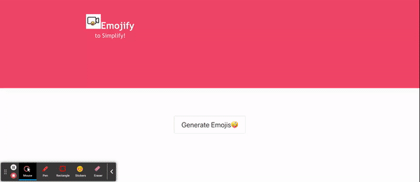

# Emojify-Group Project

## Overview

[Visit the Deployed Site](https://samhiga.github.io/emojify/ )

There are thousands of movies available for streaming. Users end up spending hours to pick a movie. This app makes it easier for users to decide on a movie based on user's moods and inclinations that are expressed through emojis. The user is presented with emojis to pick from and the algorithm recommends a list of movies.

## Technologies Used


* [HTML](https://developer.mozilla.org/en-US/docs/Web/HTML)
* [CSS](https://developer.mozilla.org/en-US/docs/Web/CSS)      
* [Git](https://git-scm.com/)   
* [DOM](https://developer.mozilla.org/en-US/docs/Web/API/Document_Object_Model/Introduction)
* [JavaScript](https://www.javascript.com/)    
* [jQuery](https://jquery.com/)
* [ajax](https://api.jquery.com/jquery.ajax/)
* [Web API](https://developer.mozilla.org/en-US/docs/Web/API)
* [Bulma](https://bulma.io/)
* [CSS Loaders](https://cssloaders.github.io/)
* [AOS](https://michalsnik.github.io/aos/)


## Code Snippet
```javascript
   var tile = $('<div class="column is-one-third is-flex">');
    // add styling to tiles here!
    var box = $('<article class="tile is-child box has-background-danger is-align-items-center">');
    var title = $('<p class="title has-text-light">').text(movie.title);
    var year = $('<p class="has-text-light">').text('Year: ' + movie.year);
    var overview = $('<p class="has-text-light">').text (movie.overview);
    var image = $('').attr('src', movie.posterURLs['185']);
```
In the above code I used Bulma to style our movie ID in javascript. Since nothing but the ID of movie was in HTML, this was the best way to style it by using the variables to appended to our ID and applying the Bulma style here. I also had to create the tile and box variables so they would display as a tile as well.

## Usage 

Once on our site, the user will click the generate emoji button. From there they will get 10 emojis to pick from based on there mood. After that they pick another emoji from 10 that represents a keyword. After both emojis are picked, movie suggestions will appear based on those emojis. Users also have the option to look at their past emojis choices and the movies that displayed



## Learning Points:

We learned how to utilize multiple APIs and manipulate them to function the way we want them to. We also gained experience researching other libraries we haven't used before and got better at reading documentation to use them. Another big thing we learned and eperienced was working as team. It was rough at first, but we were able to get into a flow and be more productive. 

## Demo

## Contributors

[Emanuel Molina](https://github.com/AcquahLopid/) <br />
[Liubov Sobolevskaya](https://github.com/LiubovSobolevskaya) <br />
[Sabeen Chaudhry](https://github.com/sabeen44) <br />
[Sam Higa](https://github.com/samhiga) <br />
